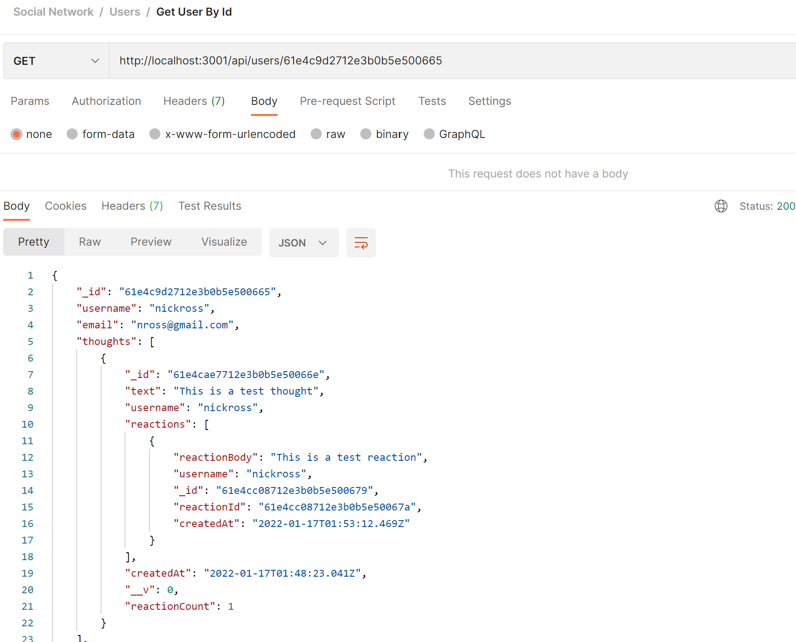
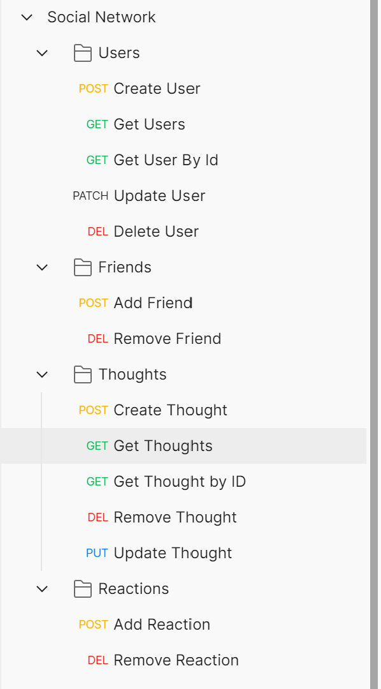

# SOCIAL NETWORK API

[](https://github.com/msp4msps)
[](https://github.com/msp4msps/social_network_api)
[](https://github.com/msp4msps/social_network_api)
[](https://choosealicense.com/licenses/mit/)

## Table of Content

- [ Project Links ](#Project-Links)
- [ Screenshots](#Screenshots)
- [ Project Description ](#Project-Description)
- [ User Story ](#User-Story)
- [ Technologies ](#Technologies)
- [ Installation ](#Installation)
- [ Usage ](#Usage)
- [ Credits and Reference ](#Credits-and-Reference)
- [ Tests ](#Tests)
- [ Contributing ](#Contributing)
- [ Questions ](#Questions)
- [ License ](#License)

#

## Project Links

https://github.com/msp4msps/social_network_api<br>

## Screenshots-Demo

<kbd></kbd><kbd></kbd>

## Project Description

API for a social network web application where users can share their thoughts, react to friends’ thoughts, and create a friend list.

## User Story

AS A social media startup, I WANT an API for my social network that uses a NoSQL database, SO THAT my website can handle large amounts of unstructured data

## Technologies

```
NodeJs, Express, MongoDB, Mongoose
```

## Installation

Fork the repo and run npm index.js locally

## Usage

Run locally and use Insomnia/Postman to test API calls

## Tests

Fork the repo, run npm install, run npm index.js, leverage POSTMAN to test calls

## Contributing

Open a pull request

## Questions

Contact the author with any questions!<br>
Github link: [msp4msps](https://github.com/msp4msps)<br>
Email: msp4msps@tminus365.com

## License

This project is [MIT](https://choosealicense.com/licenses/mit/) licensed.<br />
Copyright © 2022 [NICK ROSS](https://github.com/msp4msps)
